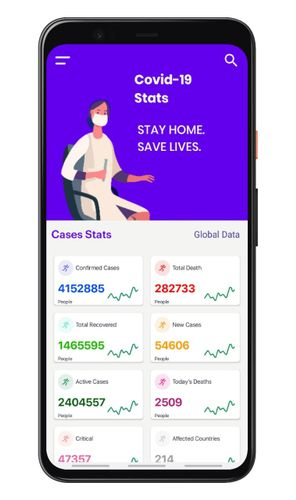
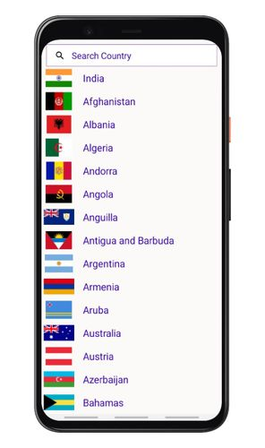
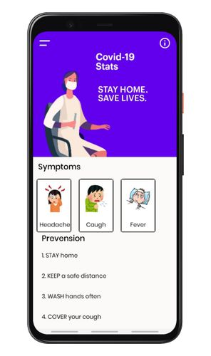

# COVID19App
Android App

This app is made on an android studio using java language.
This Project is an android app that fetches the data from Novel COVID-19 API and shows within the app. The data of the app is updated in every 10 min so it shows the real-time cases of corona pandemic. This app gives the case updates of a specific country. Users have to click on the search button and select the country. In real-time this project have the data of 214 countries.
It also gives the information about symptoms and prevention from COVID-19.

    
